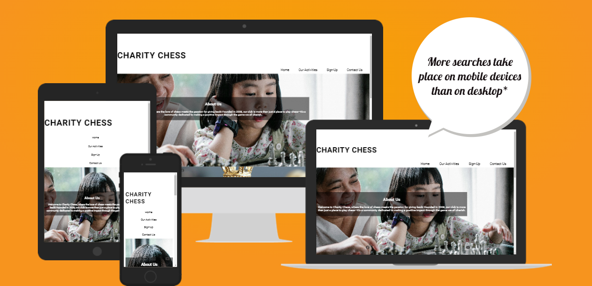
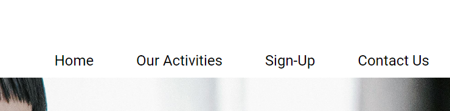
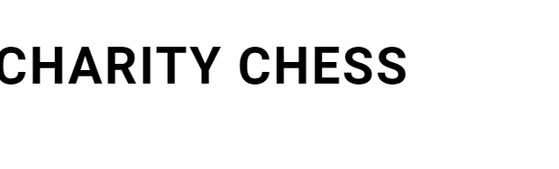
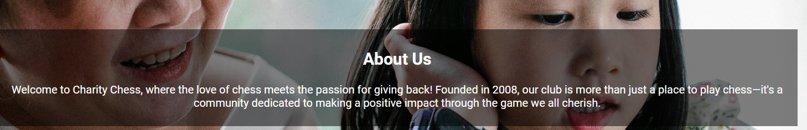
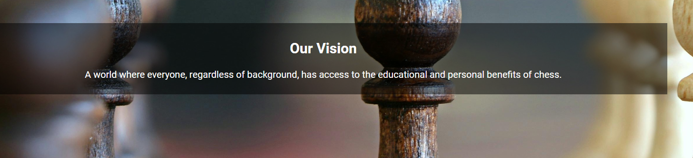
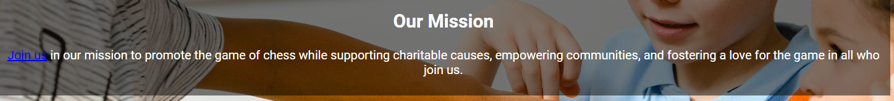
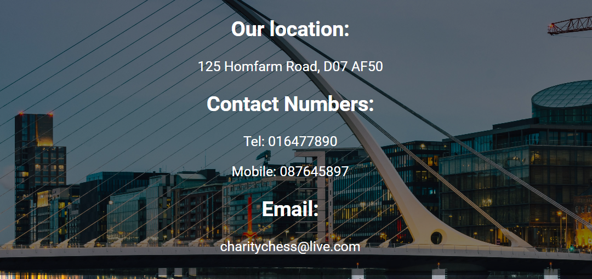
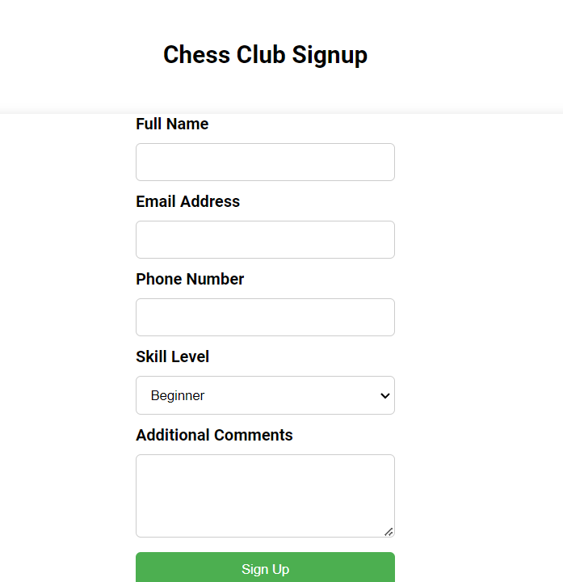
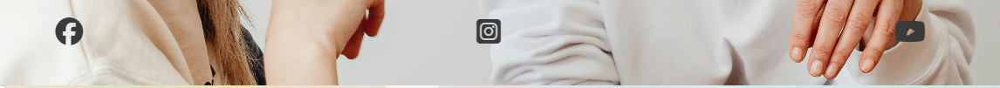

# Charity Chess

Charity Chess is a chess club that is dedicated to charitable pursuits while promoting the game of chess. The website is structured to provide information about the club, in a readable and attractive way. 

Users on this site will find it very interactive, with background images and clear easy to read cover text. There is an activies section, listing the ways we use chess to raise money for charities. There is also a signup page whiching brings the user to a fully functioning sign-up form. The contact section in the nav bar has the relevant address, email and phone numbers. 

## Features

* Navigation 

The Nav bar is located at the top right of the page, while displayed on large screens. There are four pages in the navigation section. 

+ **Home** This is the landing page. 
+ **Our Activities** This is the page that lists all the charity events associated with chess that the club partakes in. 
+ **Sign Up** This page is a form for users to fill out if they wan't to join our club. 
+ **Contact** This page contains all the relevant contact information for the Club. 

### The Header 

The header shows the name of the club, which is colored black for better readability against a white background. 

### About us 
For the about us section, I used cover text over three images about chess. This way, while telling the story of the club I could enhance the SEO of the website with the input of SEO friendly information. 

In the "Our Mission" section I included an anchor element which links to the signup form. 

### Contact Us
The contact us page contains all the relevant information for contacting the chess club. Continuing with the design of the home page, the text appears as cover text over an image. 

### Sign Up Form 
This page has the sign up form to join the chess club. 

### Footer 
The footer, on every page except the sign up one contains social meda links. I have also designed it as a sticky footer so the icons stick to the screen even when scrolling. 

